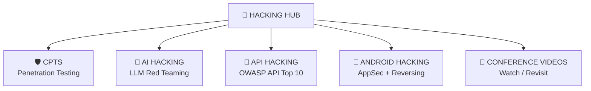

# 🧭 Hacking Hub

> Central index for all my hacking disciplines — progress tracking lives in each repo, conference learning lives here.
>
> Pick a discipline → dashboard → module → notes.

---

## 🗺️ Disciplines Map

---

## 📚 Disciplines

| Discipline | Repo | Focus | Status |
|------------|:----:|:-----:|:------:|
| 🛡️ CPTS | [CPTS](https://github.com/romeo-mhakayakora/CPTS) · [notes site](https://romeo-mhakayakora.github.io/CPTS/) | Penetration Testing Specialist path | 🔄 In Progress |
| 🤖 AI Hacking | [AI-Hacking](https://github.com/romeo-mhakayakora/AI-Hacking) | OWASP LLM Top 10, red teaming | ⬜ Not Started |
| 🔌 API Hacking | [API-Hacking](https://github.com/romeo-mhakayakora/API-Hacking) | OWASP API Top 10 | 🔄 In Progress |
| 📱 Android Hacking | [Android-Hacking](https://github.com/romeo-mhakayakora/Android-Hacking) | MASVS, reversing | ⬜ Not Started |

## 🎥 Conference Learning

- [Conference Videos](./conference-videos.md) — talks watched, links, and where I need further help or a deeper dive.

---

[⬆ Back to top](#-hacking-hub)